# Colab訓練YOLO v5實現口罩偵測

本文介紹在Googlecolab上訓練yolov5進行目標偵測的基本流程。 yolo系列模型是目前最先進的目標偵測模型之一。 YOLO V5效能與YOLO V4不相伯仲，但其個頭比V4小得多，模型訓練速度也要快上不少。

本文前置條件：為了能夠存取Colab，需要電腦能夠科學上網。

Colab是Google提供的線上jupyter筆記本，其為勞苦大眾提供了6個小時連續白嫖Tesla GPU的機會（一次使用不超過6個小時，到點兒了會自動斷開連接）。另外Colab提供了多種深度學習框架支援（TensorFlow，PyTorch等），這對於學習者來講是非常不錯的運算資源。

Colab網址：(https://colab.research.google.com/notebooks/welcome.ipynb)  

## 1.設定計算環境

進入Colab後第一步是新建一個筆記本，如下圖所示。

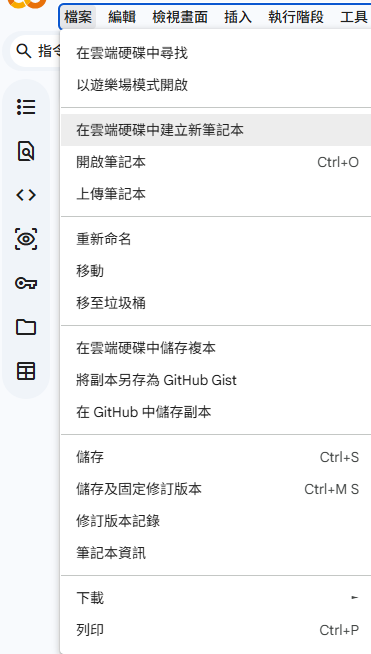

選擇程式碼執行程序→ 更改運行時類型

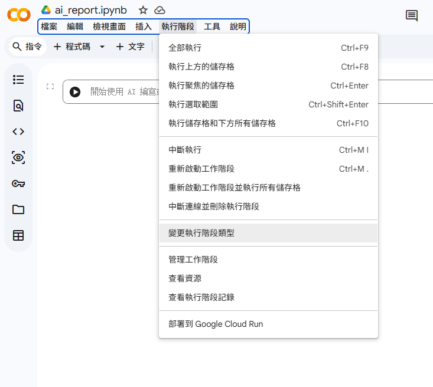

在開啟的對話方塊中選擇硬體加速器為GPU

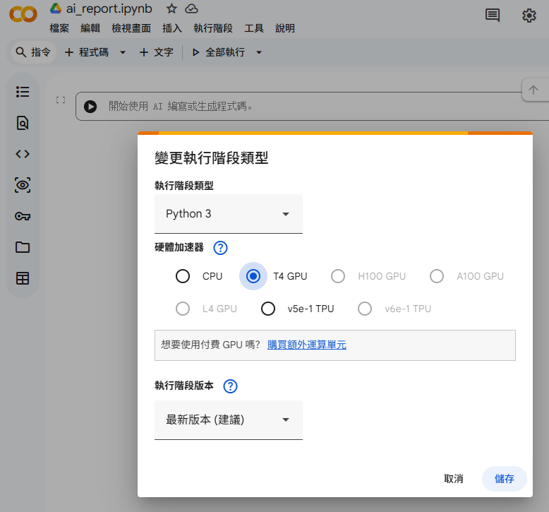

這樣就可以使用Google提供的GPU了。 

## 2.連接谷歌硬碟

Colab不會保存數據，這時候最好連接自己的Google硬碟。

在筆記本中輸入下面的程式碼並運行。

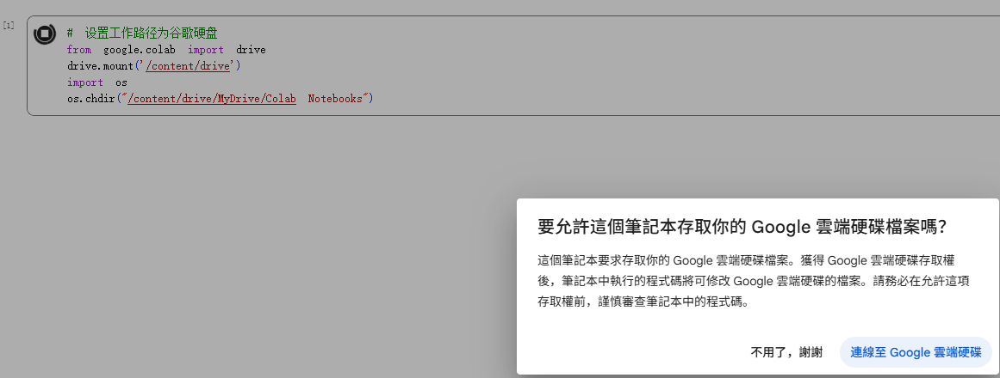

選擇要登入帳戶

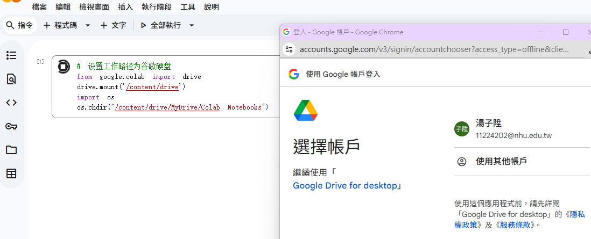

允許Google Drive for desktop存取個人資訊，點選繼續

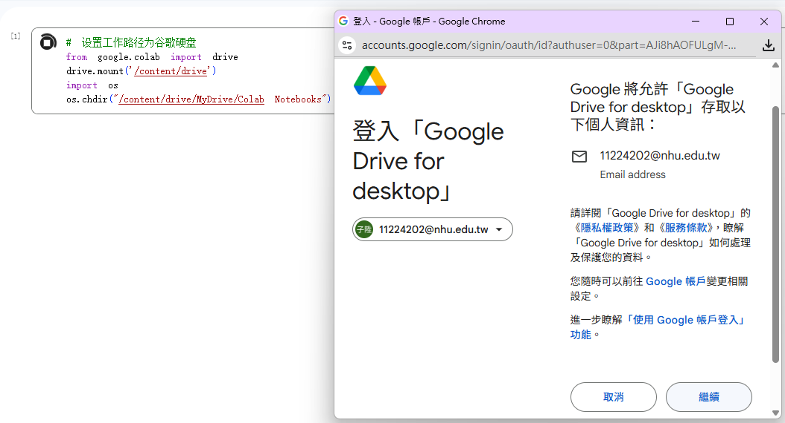

選取要讓Google Drive for desktop存取的範圍，點選全選後再點選繼續

谷歌硬碟連線成功後如下圖所示。

## 3.下載yolov5

建立新的程式碼區塊，在程式碼區塊中輸入下面的程式碼並執行。

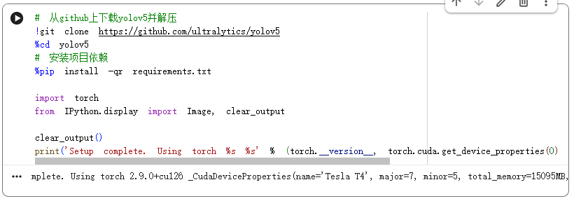

運行完畢後可以看到此時Colab 給分配了一個Tesla T4的顯示卡，顯存約15GB（15095MB）。PyTorch版本為2.9.0，CUDA版本為12.6。

註：Colab的顯示卡分配是隨機的，有時候分配K80，有時候分配T4，全看個人運氣。

## 4.上傳資料集 

資料集可以自己製作，也可以使用別人製作的。自己製作資料集的話可以使用labelimg，注意選擇輸出為yolo格式。這裡簡單起見使用網路上公開的資料集。網站[Roboflow 公開資料庫](https://public.roboflow.com/)提供了許多用於目標檢測的公開資料集，例如常見的微軟COCO資料集，牛津Pets資料集等。這裡找個小型的口罩資料集，這個資料集規模很小，只有149張照片。 （呃，相對於COCO十幾萬張照片來說真的可以忽略不計了）

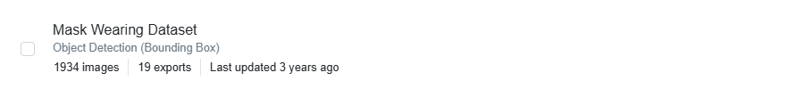

點擊進去下載。

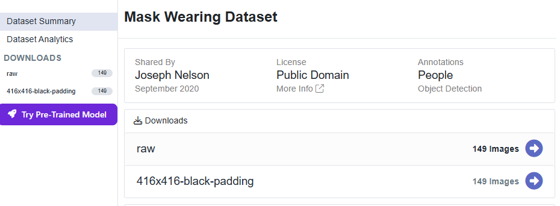

選擇YOLO v5 PyTorch格式，如下圖所示

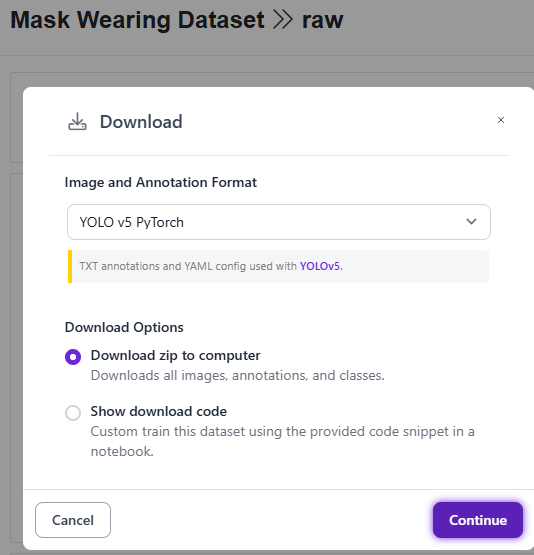

下載完畢後將壓縮檔上傳到Google網盤，我這裡將壓縮檔改名為mask.zip，如下圖所示

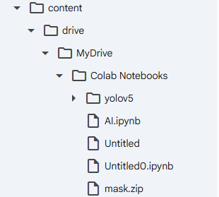

新增程式碼區塊，輸入並執行下面的命令，將mask.zip檔案解壓縮到mask資料夾中，解壓縮完畢後目錄結構如下圖所示。

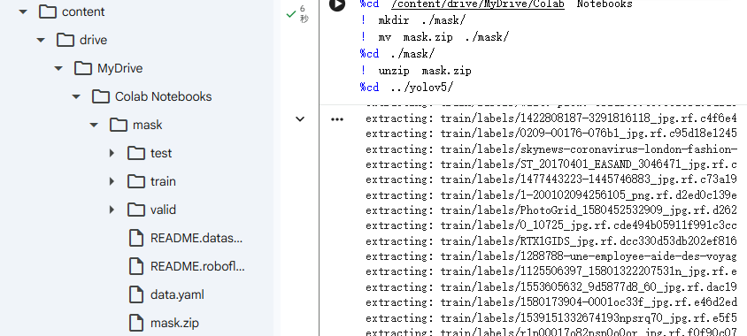

## 5.模型訓練 

在進行訓練之前，需要修改一些參數。

修改mask/data.yaml文件內容。主要是修改train及val的檔案路徑，這個根據yolov5的相對路徑進行修改

修改文件yolov5/models/yolov5s.yaml，將nc = 80修改為nc = 2，因為資料集中只有mask和no-mask2個類別，這裡需要與資料集類別數保持一致

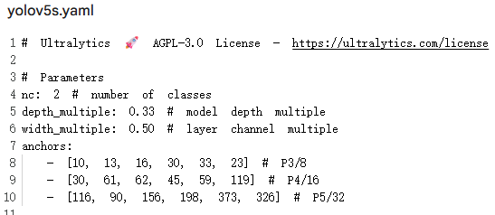

新增並運行程式碼區塊進行訓練，就會發現Colab環境中缺少ultralytics函式庫。雖然運行的是YOLOv5，但較新版本的YOLOv5 程式碼引用了ultralytics提供的工具函數

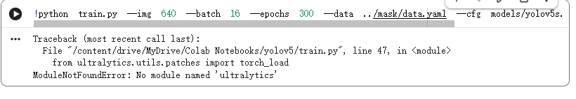

所以為了避免後續出現其他類似的ModuleNotFoundError（例如缺少pandas、requests等），建議直接安裝YOLOv5資料夾下自帶的依賴清單：

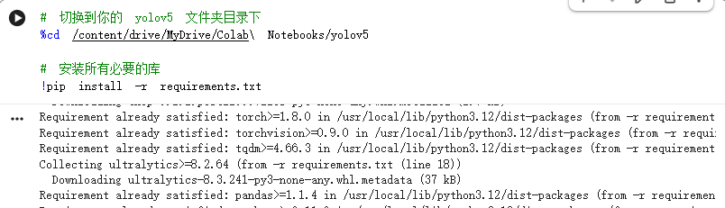

解決了ModuleNotFoundError，程式碼已經可以跑起來了，但目前控制台停在了W&B (Weights & Biases)的登入提示介面。 W&B 是一個用於記錄訓練實驗、查看損失曲線和預測樣本的線上工具。

你需要做的操作：
在Colab 的輸入框中輸入數字並按enter：

輸入1：如果你想註冊/登入W&B 帳號。它會給你一個鏈接，複製裡面的API Key 貼回來即可。這樣你可以在網頁上即時看到漂亮的訓練圖表。

輸入2：如果你已有帳號。

輸入3：（推薦初學者）如果你現在只想趕緊開始訓練，不想配置帳號，輸入3然後按回車。系統將不會上傳資料到雲端，只在本機上保存日誌。

我們直接輸入3，正常來說就能正常開始跑進度條

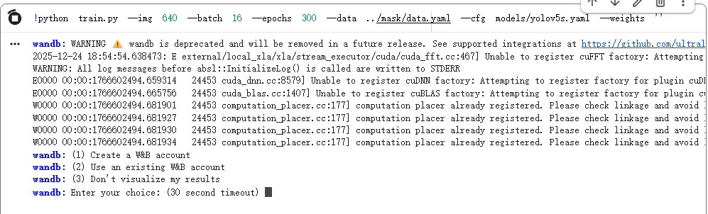

再來就會發現格式錯誤（Syntax Error）。現在的問題出在你的資料集設定檔 ../mask/data.yaml上。

錯誤訊息yaml.scanner.ScannerError: mapping values are not allowed here並且指向Line 2, Column 6，通常只有兩個原因：

縮排錯誤（最可能）：第2 行前面多了空格，導致沒有和第1 行對齊。 YAML 檔案對縮排非常敏感，不能隨便按空格或Tab。

冒號後缺空格：像key:value這樣寫是錯的，必須寫成key: value（冒號後面必須有一個空格）。

這時候我們直接使用快速修復方案（直接覆蓋重寫）
如果你確定你的資料集路徑結構是標準的（例如mask/train和mask/val），你可以直接運行下面的Python 程式碼，它會幫你產生一個格式完全正確的data.yaml覆蓋掉那個壞檔案，並請根據你的實際類別修改names和nc

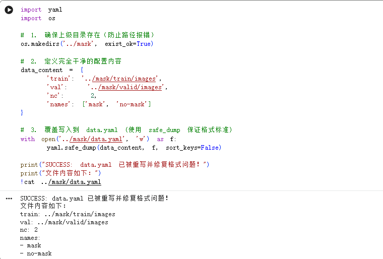

運行完上面的修復程式碼後，就可以再次執行訓練指令了，訓練完畢後出現如下圖提示。

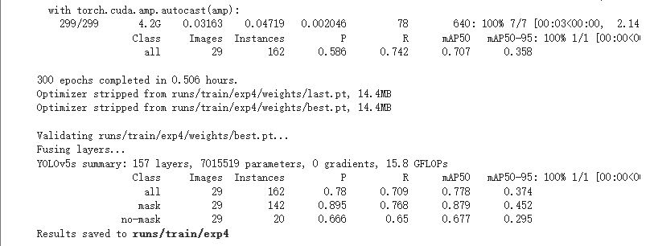

訓練得到的權重檔案存放在 runs/train/exp4/weights/ 資料夾中（對應表現最佳的 YOLOv5s 模型），通常使用 best.pt 檔案進行後續檢測

## 6.測試模型

上網隨便找張有口罩的圖片

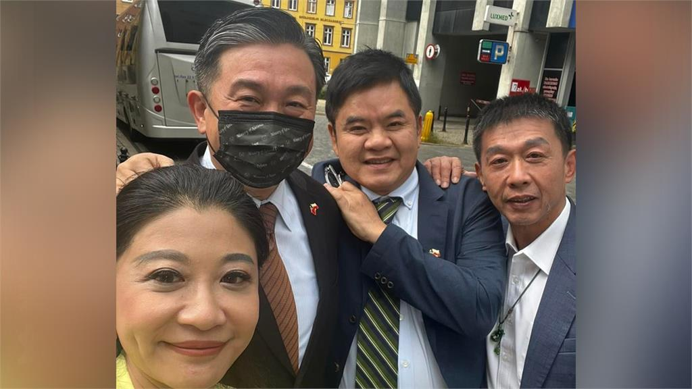

將圖片上傳到Colab中，重新命名為mask.jpg（什麼名字都可以，這裡只是方便後面描述），將檔案放到yolov5資料夾中。

添加並運行下面的程式碼，輸出結果如下圖所示。結果提示辨識到了3個戴口罩，2個未戴口罩。

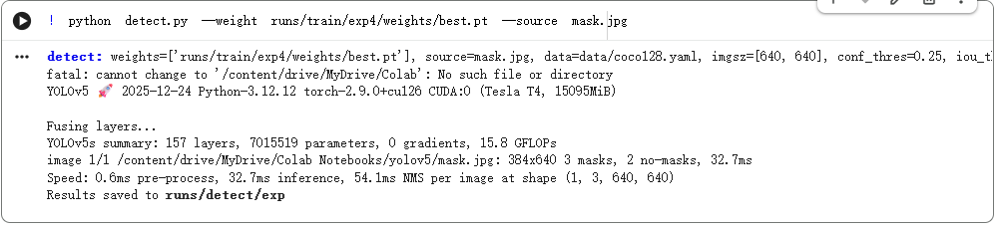

識別後的結果存放在資料夾runs/detect/exp中。打開該資料夾中的mask.jpg文件，識別結果如下圖所示。

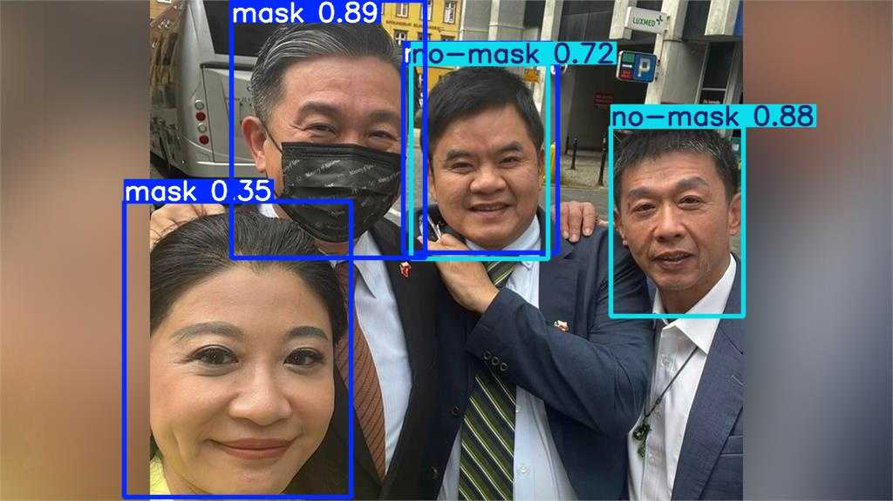

可以看到還是存在一些漏檢，尤其是旁邊的女生那麼明顯地未戴口罩卻沒有被檢測出來，而且明明只有4個人卻檢測到5個人。目前本文示範使用的是利用yolov5s進行的訓練，yolo5s是yolov5系列中最小的網路模型。如果想要提高檢測精度，一方面可以使用用更複雜的模型（如yolov5m、yolov5l、yolov5x等）進行訓練，另一方面可以提高樣本資料品質以及增加訓練集樣本數量（這裡訓練集只有149張圖片）。

所以我們針對目前的情況（在Google Colab上使用Tesla T4 GPU，且數據集規模看起来不算特別大），我們會最推薦你嘗試YOLOv5m，因為YOLOv5的模型從s到x，參數越來越多，雖然精度會提升，但訓練難度和硬體需求也呈指數級上升。

理由一：邊際效應遞減
從s換到m，通常能看到最明顯的精度跳躍。但從m到l或x，在中小規模數據集上，精度的提升往往不如預期那麼大，但訓練時間卻會變成2倍甚至3倍。

理由二：Colab的限制
Colab通常使用的是Tesla T4(16GB顯存)。跑yolov5m非常輕鬆。跑yolov5l可能需要把batch-size調小（例如從16調到8），這會導致訓練更不穩定。跑yolov5x在Colab免費版上通常是一種折磨。

理由三：過擬合風險 
數據集看起來不算巨大。如果模型太大（如5x），參數甚至比你的數據還多，模型會傾向於「死記硬背」訓練集，導致在驗證集或真實場景下表現反而變差（過擬合）。

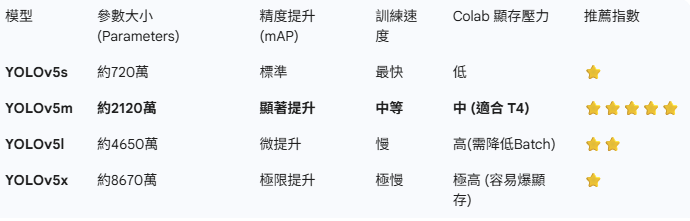

### 如何切換到YOLOv5m？
非常簡單，你只需要修改訓練命令中的 --weights 參數，系統會自動下載並使用新模型。

!python train.py --img 640 --batch 16 --epochs 300 --data ../mask/data.yaml --cfg models/yolov5m.yaml --weights ''

